# ContextBridge

**ContextBridge is a security-first Model Context Protocol (MCP) gateway that lets AI assistants inspect, reason over, and safely interact with GitHub repositories through a controlled, auditable tool layer.**

Instead of giving an LLM unrestricted access to GitHub credentials or letting it call arbitrary APIs directly, ContextBridge sits between the model and GitHub and exposes a deliberately scoped set of MCP tools. Every operation passes through explicit policy, telemetry, and safety controls.

The project combines:

- GitHub repository intelligence
- Model Context Protocol tooling
- Gemini, OpenAI, and local-model support
- MCP-native tool orchestration
- Human-in-the-loop mutation approvals
- Dry-run execution
- Repository allowlisting
- Signed approval records
- SQLite telemetry and audit logging
- Deterministic evaluation
- A local React control plane
- Persistent AI chat
- Tool-call visualization
- VS Code MCP integration

The result is an AI-to-GitHub infrastructure layer designed around **least privilege, observability, explicit authorization, and controlled execution**.

---

## Table of Contents

- [Why ContextBridge Exists](#why-contextbridge-exists)
- [Core Design Principles](#core-design-principles)
- [High-Level Architecture](#high-level-architecture)
- [End-to-End Request Flow](#end-to-end-request-flow)
- [Integrated AI Chat](#integrated-ai-chat)
- [MCP Server](#mcp-server)
- [GitHub Tooling](#github-tooling)
- [Read Operations](#read-operations)
- [Mutation Safety Architecture](#mutation-safety-architecture)
- [Human Approval Flow](#human-approval-flow)
- [Security Model](#security-model)
- [Telemetry and Audit Logging](#telemetry-and-audit-logging)
- [Evaluation Framework](#evaluation-framework)
- [Dashboard Control Plane](#dashboard-control-plane)
- [VS Code MCP Integration](#vs-code-mcp-integration)
- [Project Structure](#project-structure)
- [Installation](#installation)
- [Environment Configuration](#environment-configuration)
- [Running ContextBridge](#running-contextbridge)
- [Using the Chat Interface](#using-the-chat-interface)
- [Using ContextBridge from VS Code](#using-contextbridge-from-vs-code)
- [Available MCP Tools](#available-mcp-tools)
- [Safety Defaults](#safety-defaults)
- [Threat Model](#threat-model)
- [Example Workflows](#example-workflows)
- [Testing](#testing)
- [Design Decisions](#design-decisions)
- [Limitations](#limitations)
- [Roadmap](#roadmap)

---

## Why ContextBridge Exists

LLMs are increasingly capable of understanding source code, planning software changes, and operating external tools. The harder problem is how to let a model access real developer systems **without giving it excessive authority**.

A naive architecture often looks like this:

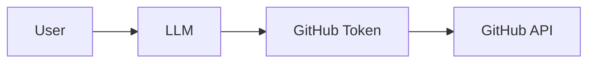

This creates several problems:

- The model may be exposed too directly to credentials.
- Tool permissions may be broader than the user's actual request.
- Read and write capabilities can become difficult to separate.
- There may be no durable audit trail.
- A generated action can become an executed action without a human checkpoint.
- Prompt injection inside repository content may influence the model.
- There may be no consistent policy layer between reasoning and execution.

ContextBridge introduces a dedicated control boundary:

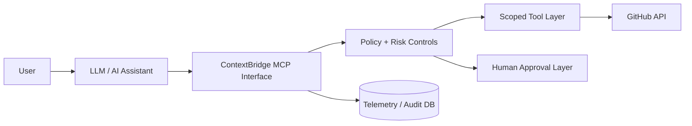

The model can reason and request actions, but **ContextBridge owns execution**.

---

## Core Design Principles

### 1. Least Privilege

The model sees only explicitly exposed tools.

Read-only operations are separated from mutation-capable operations, and write execution remains gated by additional policy.

### 2. Human Authorization for Mutations

Potentially destructive or state-changing actions do not automatically become live GitHub operations.

The system can convert them into pending actions that require explicit human approval.

### 3. AI Cannot Self-Approve

Approval and rejection are intentionally kept outside the MCP tool surface.

The model can request an action, but it cannot approve its own request.

### 4. Dry-Run by Default

The default runtime posture is intentionally conservative:

```dotenv
CONTEXTBRIDGE_DRY_RUN=true
GITHUB_WRITES_ENABLED=false
```

This means mutation flows can be exercised without sending live GitHub write requests.

### 5. Auditability

Tool calls, results, durations, policy outcomes, chat sessions, and evaluation data can be persisted locally.

### 6. Provider Independence

The control plane is not tied to one LLM vendor.

ContextBridge supports provider abstraction for:

- Gemini
- OpenAI
- Ollama / local models

The model provider changes, but the MCP and safety architecture remain the same.

### 7. Repository Content Is Untrusted Data

Repository files, issues, comments, and other GitHub text are treated as data, not instructions.

This matters for reducing prompt-injection risk.

---

# High-Level Architecture

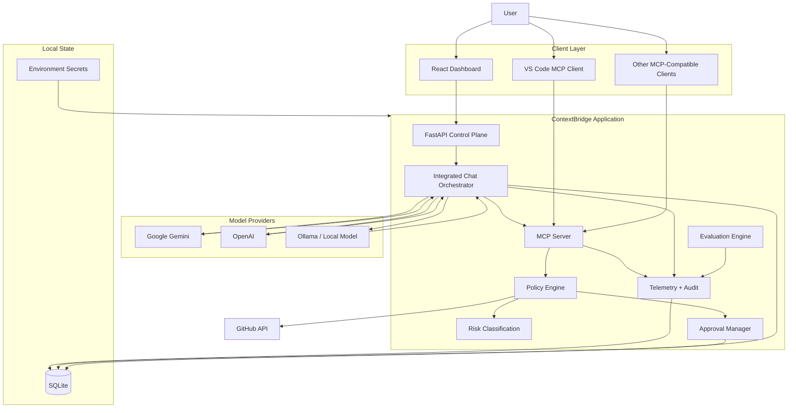

---

# End-to-End Request Flow

A typical read-only request such as:

> "Inspect this repository and explain its architecture."

follows this path:

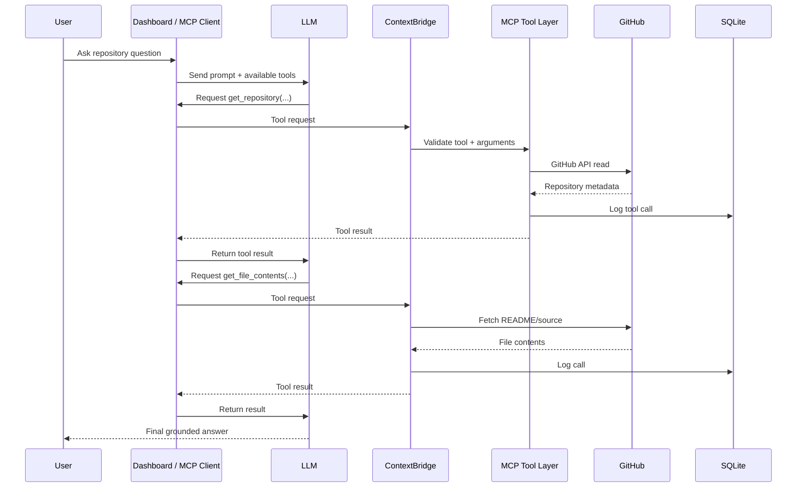

The key point is that the model does not directly call GitHub. It requests a named ContextBridge tool, and ContextBridge performs the operation.

---

# Integrated AI Chat

ContextBridge includes a local chat interface inside the dashboard.

The chat system combines:

- persistent conversations
- configurable LLM provider
- dynamic MCP tool discovery
- model-selected tool calls
- read-only mode
- tool execution timeline
- local chat persistence
- credential isolation
- MCP-based repository access

## Chat Architecture

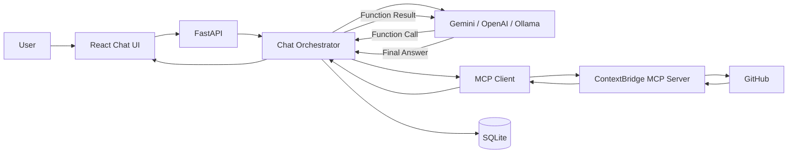

## Why Tool Execution Is Manual

LLM SDKs can often execute Python functions automatically. ContextBridge deliberately avoids delegating tool execution directly to the SDK.

The model may choose:

```text
get_repository
```

with arguments such as:

```json
{
  "owner": "example-user",
  "repo": "example-repo"
}
```

But ContextBridge itself executes the tool.

This ensures that every tool call still passes through:

- MCP
- read-only restrictions
- risk classification
- telemetry
- mutation policy
- approval requirements
- dry-run controls

The model provider therefore remains a **reasoning layer**, not the authority layer.

---

# MCP Server

ContextBridge exposes its capabilities through the **Model Context Protocol**.

The MCP server acts as the standardized interface between AI clients and controlled developer tooling.

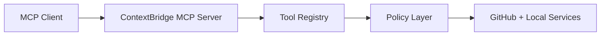

This enables ContextBridge to work with more than its own dashboard.

An MCP-compatible client can discover available tools dynamically and invoke them using the standard protocol.

---

# GitHub Tooling

ContextBridge's GitHub integration is divided into two broad categories:

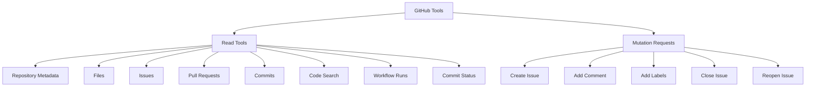

---

# Read Operations

Read tools are intended for repository inspection, code understanding, debugging, research, and developer assistance.

Examples include:

- listing repositories
- reading repository metadata
- reading files
- searching code
- searching issues
- reading issue details
- listing pull requests
- reading pull requests
- listing commits
- checking CI/workflow runs
- checking commit status

These tools are suitable for tasks such as:

> "Explain what this repository does."

> "Find where authentication is implemented."

> "Summarize open issues related to deployment."

> "Inspect the README and source tree and explain the architecture."

> "Find which workflow is failing."

---

# Mutation Safety Architecture

Mutation-capable tools are handled differently from read tools.

A requested mutation is not automatically equivalent to a live GitHub API write.

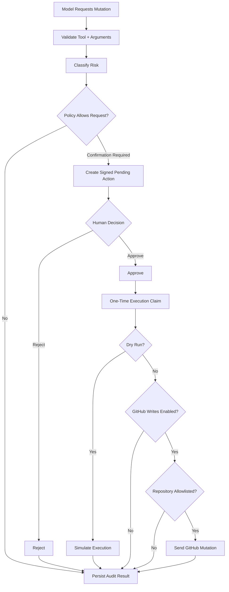

This structure allows mutation workflows to be tested end-to-end without granting the model unrestricted write capability.

---

# Human Approval Flow

Pending actions are persisted locally.

A pending action contains information such as:

- action ID
- requested tool
- arguments
- risk level
- creation time
- expiry
- decision state
- integrity signature

The approval path is intentionally separate from MCP:

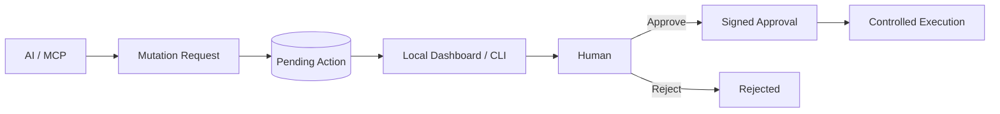

The AI does **not** receive an MCP tool such as:

```text
approve_pending_action
```

That omission is intentional.

It prevents a model from generating an action and then immediately granting itself permission to execute it.

---

# Security Model

ContextBridge's security model is layered rather than dependent on one switch.

## Layer 1: Secret Isolation

Secrets remain in local environment configuration.

Examples:

```dotenv
GITHUB_TOKEN=...
GEMINI_API_KEY=...
OPENAI_API_KEY=...
```

The browser does not need access to these values.

The dashboard receives only non-secret provider state such as:

```json
{
  "provider": "gemini",
  "model": "gemini-3.6-flash",
  "configured": true
}
```

## Layer 2: Tool Surface Restriction

The model can only call registered MCP tools.

It does not receive a generic unrestricted shell or arbitrary GitHub HTTP tool.

## Layer 3: Read-Only Mode

Integrated chat can expose only read-classified tools.

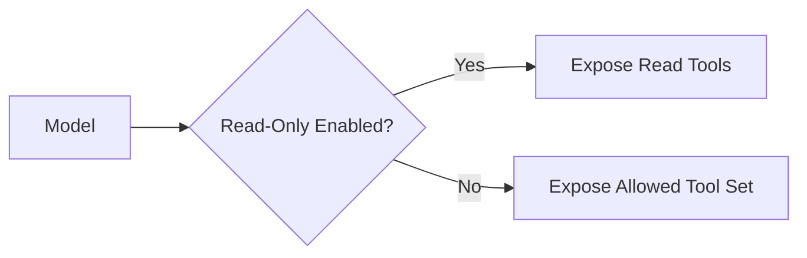

## Layer 4: Risk Classification

Tools are assigned risk semantics so that policy can distinguish reads from mutations.

## Layer 5: Confirmation

Sensitive operations can require human confirmation.

## Layer 6: Signed Actions

Pending actions and approvals are integrity-protected.

## Layer 7: One-Time Execution

An approved action must be claimed for execution so the same approval cannot be freely replayed.

## Layer 8: Dry Run

Even an approved action can remain simulated.

## Layer 9: Write Disable Switch

```dotenv
GITHUB_WRITES_ENABLED=false
```

provides a separate global write gate.

## Layer 10: Repository Allowlisting

If live mutations are ever enabled, they can be constrained to explicitly authorized repositories.

---

# Telemetry and Audit Logging

ContextBridge records operational information in SQLite.

The telemetry system provides visibility into:

- which tool was called
- when it was called
- arguments
- result status
- duration
- error state
- risk classification
- policy outcome
- chat session association
- evaluation results

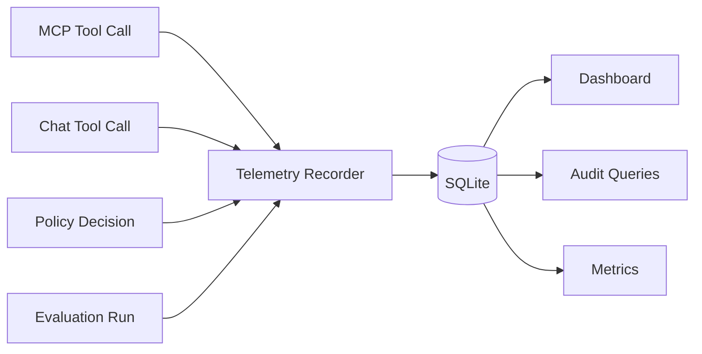

Sensitive fields are redacted where appropriate before persistence or display.

---

# Evaluation Framework

ContextBridge includes a deterministic evaluation layer for validating tool routing behavior.

The evaluation framework can measure:

- tool-selection accuracy
- argument/parameter accuracy
- risk classification accuracy
- mutation classification accuracy

Conceptually:

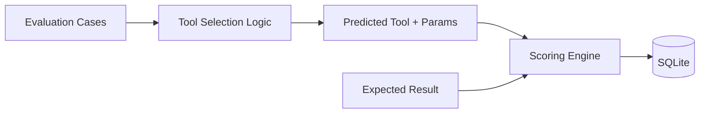

The purpose is to make tool behavior measurable instead of relying only on ad-hoc manual testing.

---

# Dashboard Control Plane

ContextBridge includes a local React/FastAPI dashboard.

Default address:

```text
http://127.0.0.1:8765
```

The dashboard provides a control plane for:

- operational overview
- integrated AI chat
- pending approvals
- audit history
- evaluations
- tool catalog
- security posture

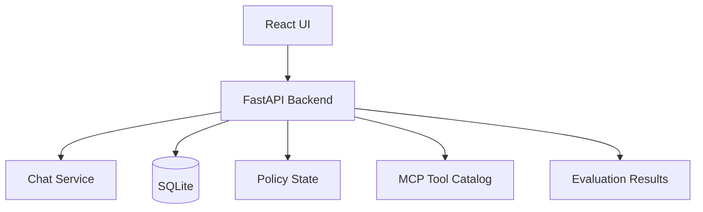

The dashboard is designed primarily as a **local control plane**, not as a public web application.

---

# VS Code MCP Integration

ContextBridge can also run as an MCP server directly inside VS Code.

Example `.vscode/mcp.json` configuration:

```json
{
  "servers": {
    "contextbridge": {
      "type": "stdio",
      "command": "${workspaceFolder}/.venv/Scripts/python.exe",
      "args": ["-m", "contextbridge.server"],
      "cwd": "${workspaceFolder}",
      "envFile": "${workspaceFolder}/.env"
    }
  }
}
```

The flow becomes:

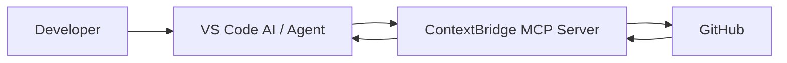

---

# Project Structure

A typical repository layout is:

```text
ContextBridge/
│
├── src/
│   └── contextbridge/
│       ├── server.py
│       ├── config.py
│       ├── chat.py
│       ├── dashboard.py
│       ├── dashboard_static/
│       ├── github/
│       ├── security/
│       ├── telemetry/
│       ├── evaluation/
│       └── tools/
│
├── dashboard/
├── docs/
├── evals/
├── scripts/
├── tests/
├── .env.example
├── .gitignore
├── pyproject.toml
├── README.md
├── SECURITY.md
└── CHANGELOG.md
```

---

# Installation

## Requirements

Recommended environment:

- Python 3.12+
- Git
- Windows PowerShell for the included Windows scripts
- GitHub account/token
- Optional Gemini, OpenAI, or Ollama configuration

Clone the repository:

```powershell
git clone https://github.com/Vatsal212005/ContextBridge.git
cd ContextBridge
```

For a fresh Windows setup:

```powershell
powershell -ExecutionPolicy Bypass -File .\scripts\setup_windows.ps1
```

---

# Environment Configuration

Create `.env` from `.env.example`.

Example:

```dotenv
# GitHub
GITHUB_TOKEN=

# Runtime safety
CONTEXTBRIDGE_DRY_RUN=true
GITHUB_WRITES_ENABLED=false
GITHUB_WRITE_REPOSITORIES=

# Integrated chat provider
CONTEXTBRIDGE_LLM_PROVIDER=gemini
CONTEXTBRIDGE_LLM_MODEL=gemini-3.6-flash

# Gemini
GEMINI_API_KEY=

# OpenAI
OPENAI_API_KEY=
OPENAI_BASE_URL=https://api.openai.com

# Ollama
OLLAMA_BASE_URL=http://127.0.0.1:11434
OLLAMA_API_KEY=

# Chat behavior
CONTEXTBRIDGE_CHAT_MAX_TOOL_ROUNDS=8
CONTEXTBRIDGE_CHAT_HISTORY_MESSAGES=30
CONTEXTBRIDGE_CHAT_READ_ONLY_DEFAULT=true
```

Never commit `.env`.

The repository should commit only `.env.example` with blank or placeholder values.

---

# Running ContextBridge

## Start the Dashboard

```powershell
powershell -ExecutionPolicy Bypass -File .\scripts\start_dashboard.ps1
```

Then open:

```text
http://127.0.0.1:8765
```

## Start the MCP Server Directly

```powershell
.\.venv\Scripts\python.exe -m contextbridge.server
```

The server uses MCP over stdio for compatible clients.

---

# Using the Chat Interface

Open the dashboard and select **Chat**.

A useful first prompt is:

> Inspect `Vatsal212005/FeatureForge`. Read the repository metadata, README, and relevant source files. Explain what the project does, its architecture, major components, and how they interact. Do not modify anything.

With read-only mode enabled, the model can inspect GitHub data but cannot request mutation tools through the chat surface.

---

# Available MCP Tools

## System

- `server_info`
- `health`
- `github_connection_status`

## GitHub Read Tools

- `list_repositories`
- `get_repository`
- `get_file_contents`
- `search_code`
- `search_issues`
- `get_issue`
- `list_pull_requests`
- `get_pull_request`
- `list_commits`
- `get_workflow_runs`
- `get_commit_status`

## Telemetry and Evaluation

- `get_tool_metrics`
- `get_recent_tool_calls`
- `get_audit_summary`
- `get_evaluation_summary`

## Policy and Pending Actions

- `get_write_policy`
- `list_pending_actions`
- `get_pending_action`
- `execute_approved_action`

## Mutation Request Tools

- `create_issue`
- `add_issue_comment`
- `add_labels`
- `close_issue`
- `reopen_issue`

These tools do not imply unrestricted live execution. Their behavior is governed by the mutation safety architecture.

---

# Safety Defaults

ContextBridge is intentionally conservative by default.

```dotenv
CONTEXTBRIDGE_DRY_RUN=true
GITHUB_WRITES_ENABLED=false
CONTEXTBRIDGE_CHAT_READ_ONLY_DEFAULT=true
```

Under this posture:

- GitHub reads can operate normally.
- The chat interface defaults to read-only.
- Mutation flows can be represented and audited.
- Live GitHub write execution remains disabled.

---

# Threat Model

ContextBridge is designed around several practical AI-tooling threats.

## Prompt Injection in Repository Content

Repository text can contain hostile or misleading instructions. ContextBridge treats that content as untrusted data and keeps execution behind a separate policy boundary.

## Model Hallucination

For GitHub-dependent claims, the system is designed to retrieve current repository state through tools instead of relying only on model memory.

## Credential Leakage

Credentials remain server-side in environment configuration and are not intentionally returned through dashboard APIs.

## Unauthorized Mutations

Mutation flows can require confirmation and remain globally disabled by default.

## Self-Approval

The model is not given approval tools.

## Replay of Approved Actions

Approved execution is tracked as a controlled, one-time claim rather than a reusable permission.

## Scope Expansion

Future live-write deployments can combine repository allowlisting with separately scoped GitHub credentials.

---

# Example Workflows

## Repository Understanding

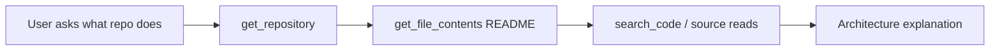

## CI Investigation

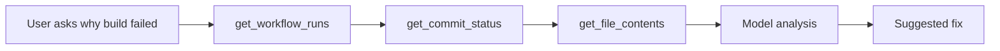

## Safe Mutation Request

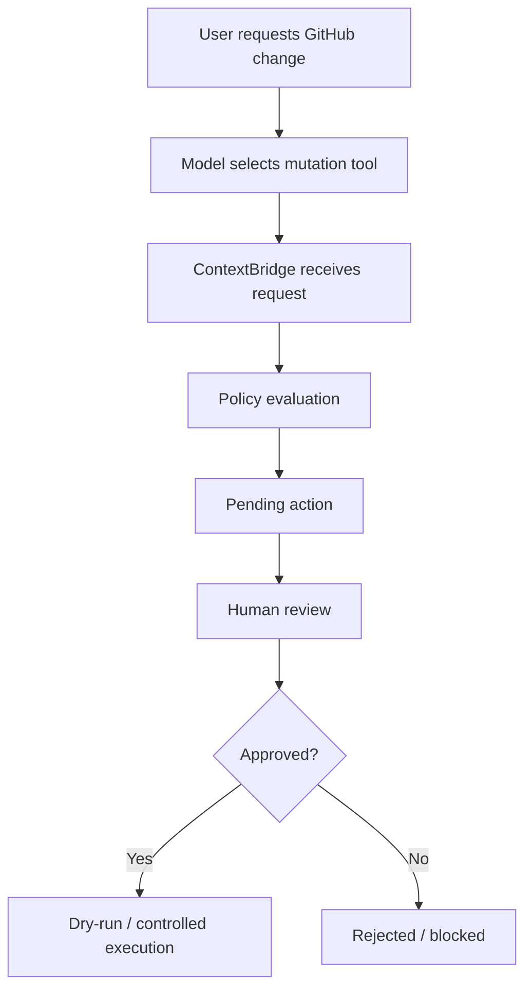

---

# Testing

Run the full Python test suite with:

```powershell
.\.venv\Scripts\python.exe -m pytest
```

The project also includes targeted verification for:

- MCP connectivity
- dashboard APIs
- integrated chat persistence
- provider configuration
- safety posture
- evaluation behavior

---

# Design Decisions

## Why MCP?

MCP creates a standardized boundary between AI clients and developer tools. ContextBridge can therefore expose the same controlled capabilities to multiple MCP-compatible clients.

## Why SQLite?

SQLite is appropriate for a local-first control plane because it provides transactional structured persistence without requiring a separate database service.

## Why Local Approval?

Keeping approval outside the model-facing tool surface prevents a model from turning its own mutation request into authorization.

## Why Multiple LLM Providers?

The model should be replaceable without redesigning the security architecture. Authority belongs to ContextBridge, not to the provider.

## Why Explicit Tool Calls?

Explicit tool calls are easier to inspect, audit, classify, test, and govern than an opaque agent with unrestricted network access.

---

# Limitations

ContextBridge is intentionally conservative.

Current tradeoffs include:

- The dashboard is primarily intended for local use.
- Live mutation execution should only be enabled with carefully scoped credentials and repository restrictions.
- Model output quality depends on the selected provider.
- Prompt injection is mitigated through defense in depth rather than assumed to be fully solved.
- Large repositories may require iterative tool calls instead of loading the entire codebase at once.

---

# Roadmap

Potential future directions include:

- stronger repository-scoped authorization policies
- richer approval policies by risk level
- additional GitHub mutation types
- finer-grained credential separation
- more MCP clients
- improved prompt-injection defenses
- richer code-graph analysis
- semantic repository indexing
- local embeddings
- repository dependency visualization
- tool-call replay and debugging
- policy simulation
- RBAC for shared deployments
- containerized deployment profiles
- richer evaluation suites
- model/provider benchmarking
- streaming model output
- organization-level GitHub policy support

---

# Security Notes

Do not commit:

```text
.env
GitHub tokens
Gemini API keys
OpenAI API keys
SQLite runtime databases
signing keys
private certificates
local chat history
```

Use `.env.example` for configuration documentation.

If a credential is accidentally committed, deleting it in a later commit is not enough because it may remain in Git history. Revoke and rotate the credential immediately.

---

# Summary

ContextBridge separates **AI reasoning** from **system authority**.

The model can decide that it wants to inspect a file or request an action, but the infrastructure decides whether that operation exists, whether it is allowed, whether it requires confirmation, and whether it can actually execute.

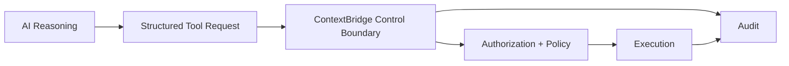

That separation is the central idea behind ContextBridge:

> **Give AI useful access to developer systems without giving it unrestricted control over them.**
